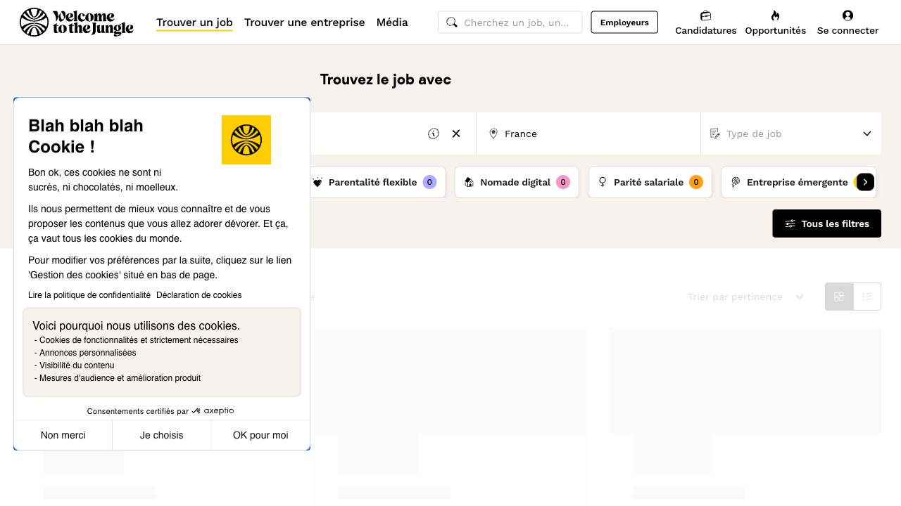

# 🤖 Copilote Candidature IA

**Un agrégateur d'offres d'emploi 100% autonome et sur-mesure, propulsé par l'IA.**

Créé par [Majdoline EZ-ZAHER](https://percevoirstudio.com) - *Développeuse Web Fullstack & UI Designer*

---

## 🎯 Le Projet

Dans le cadre de ma recherche d'un poste de Développeuse Web en **100% Télétravail**, j'ai constaté que les plateformes traditionnelles étaient souvent inondées d'offres "hybrides" déguisées en remote, ou demandaient un temps de tri manuel considérable.

Plutôt que de scroller manuellement, j'ai développé ce **Copilote IA**. Ce programme explore automatiquement les job boards, lit les descriptions à ma place, utilise l'intelligence artificielle pour débusquer les "faux" télétravails, et centralise les meilleures opportunités dans un Dashboard Next.js sur-mesure.

 
*(Aperçu de l'interface de gestion)*

## ✨ Fonctionnalités Principales

* 🕵️‍♀️ **Scraping Multi-Sources :** Extraction automatisée des offres depuis **LinkedIn** (via Playwright en headless), **Welcome to the Jungle** et l'API **Remotive**.
* 🧠 **Filtrage IA (Google Gemini) :** Le script n'utilise pas de simples mots-clés. Il envoie la description du poste à Gemini qui l'analyse selon mes critères stricts (Full remote obligatoire, tolérance sur l'anglais et le niveau de diplôme).
* 📊 **Dashboard Fullstack :** Une interface moderne (Next.js / TailwindCSS) pour visualiser les offres retenues, lire les avis de l'IA et suivre l'état des candidatures.
* 📝 **Génération de Lettre de Motivation :** Création instantanée d'accroches personnalisées basées sur le "match" entre mon profil et la description du poste.
* 💾 **Système de Mémoire :** Le robot mémorise les offres déjà analysées (Rate Limiting & Caching) pour optimiser les appels API et ne proposer que de la nouveauté.

## 🛠️ Stack Technique

**Backend / Data (Le Cerveau)**
* `Python 3`
* `Playwright` (Web Scraping dynamique)
* `BeautifulSoup4` & `Requests` (Parsing HTML & API)
* `Google Gemini 2.5 Flash API` (Analyse LLM)
* `Expressions Régulières (Regex)` & `CSV` (Traitement et stockage des données)

**Frontend (L'Interface)**
* `React.js` / `Next.js`
* `Tailwind CSS` (UI Design Glassmorphism)
* `PapaParse` (Lecture CSV côté client)

## 🚀 Comment ça marche ?

1. Le fichier `scraper.py` est lancé localement. Il active ses robots navigateurs invisibles.
2. Il aspire les offres, nettoie le texte et l'envoie à Gemini avec un prompt contenant mon CV.
3. Les offres validées par l'IA sont injectées dans une base de données locale (`.csv`).
4. Le frontend Next.js lit ces données en temps réel et offre une interface d'action (Postuler, Générer une lettre, Archiver).

---

*Ce projet est une démonstration technique de mes compétences en automatisation (Python), en intégration d'API d'Intelligence Artificielle et en développement Frontend moderne (Next.js/React).*